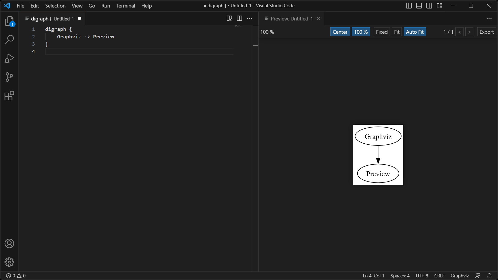

# Graphviz Preview

An extension for Visual Studio Code to preview Graphviz (DOT) files.

## Usage

### Open preview

Open the [Command Palette](https://code.visualstudio.com/docs/getstarted/userinterface#_command-palette) (usually by
pressing <kbd>Ctrl</kbd> + <kbd>Shift</kbd> + <kbd>P</kbd>), then select “Graphviz: Show Preview”.

### Manipulate preview

| Action           | Gesture                                                                                                                                       |
| ---------------- | --------------------------------------------------------------------------------------------------------------------------------------------- |
| Zoom in          | Mouse wheel up / <kbd>+</kbd>                                                                                                                 |
| Zoom out         | Mouse wheel down / <kbd>-</kbd>                                                                                                               |
| Toggle 100% zoom | Mouse double click / <kbd>Space</kbd>                                                                                                         |
| Pan              | Mouse drag / <kbd>Left</kbd> / <kbd>Right</kbd> / <kbd>Up</kbd> / <kbd>Down</kbd> / <kbd>A</kbd> / <kbd>D</kbd> / <kbd>W</kbd> / <kbd>S</kbd> |
| Zoom to 100%     | <kbd>0</kbd>                                                                                                                                  |
| Move to center   | <kbd>X</kbd>                                                                                                                                  |

There are three zooming modes: **Fixed**, **Fit** and **Auto Fit**.

- **Fixed**: The zoom ratio does not change when the source changes or the window size changes.
- **Fit**: The graph is scaled to align to the border of the visible view area.
- **Auto Fit**: When the view area is big enough to contain a 100% sized graph, the graph will be set a zoom ratio of
  100%, otherwise the graph is scaled to fit into the view area.

### Export graph

To export the generated graph, click the “Export” button on the top right corner.

## Configuration

| Configuration             | Type               | Description                                                                                                                                    |
| ------------------------- | ------------------ | ---------------------------------------------------------------------------------------------------------------------------------------------- |
| `graphvizPreview.dotPath` | `string` \| `null` | `null` means use the “dot” program in your `PATH` environment variable, or a `string` value to indicate the “dot” program you want to use. |

Make sure the extension can find the “dot” program. You can set `graphvizPreview.dotPath` option to the path of the dot
executable, or make sure the directory containing the dot program is in your `PATH` environment variable.

To set the `graphvizPreview.dotPath` option, go to File → Preference → Settings.

## Roadmap

- [x] Add border and shadow to indicate the graph border.
- [x] Allow user to save the generated graph.
- [x] Report error if the source is invalid.
- [x] Apply configuration change without restart.
- [x] Allow user to manipulate preview with keyboard.
- [ ] Add CI integration.
- [ ] Add animation for zooming.
- [ ] Take a new screenshot.
- [ ] Allow user to configure the default zoom mode.
- [ ] Add a preview button for source editor.
- [ ] Add cancellation support in scheduler.
- [ ] Support previewing source containing multiple graphs.

## Known issues

- After saving an untitled file, the preview becomes invalid.
- The graph border and the the shadow is not strictly aligned.
- When the zoom ratio is too large, the graph may be at a wrong position.
- Current, only one “dot” application is allowed to run, so the preview may not look very smooth when the source is
  being edited quickly.
